# RFC: Request for Comments - Projeto Portfólio
**Engenharia de Software - Católica SC**

## Identificação:
- **Título do Projeto:** Talentix - Sistema de Análise de Currículos
- **Linha do Projeto:** Web
- **Autor:** Lucas Grimes Ceola
- **Data da Proposta:** 27/02/2026
- **Versão:** 1.0

---

## 1. VISÃO DO PRODUTO E IMPACTO

### 1.1. CONTEXTO E PROBLEMA
O processo de recrutamento e seleção é uma etapa essencial para organizações que buscam identificar candidatos adequados às suas vagas, visto que, com o crescimento do número de profissionais disponíveis no mercado e a digitalização dos processos seletivos, empresas passaram a receber grandes volumes de currículos para uma única vaga.

Nesse contexto, recrutadores precisam analisar e avaliar manualmente diversos perfis de vários usuários, o que torna o processo lento, suscetível a erros e pouco escalável. Ademais, em muitas organizações, especialmente de médio e grande porte, o processo de análise e seleção de candidatos não envolve apenas um profissional, mas sim uma equipe de colaboradores encarregados das etapas de análise e avaliação, o que tende a causar ainda mais atrasos no que diz respeito ao tempo necessário para a tomada de decisão. Além disso, pequenas e médias empresas não possuem ferramentas avançadas para auxiliar nessa triagem, dependendo de processos manuais ou soluções simplificadas.

Por outro lado, do ponto de vista dos candidatos, também existem dificuldades relevantes. Muitos profissionais enfrentam a ausência de feedback sobre seus currículos, não compreendem os critérios utilizados nas seleções e encontram dificuldades em identificar pontos de melhoria, o que pode comprometer seu desempenho em processos seletivos.

A ausência de um sistema que favoreça a metodologia de análise de currículos de forma mais completa, robusta e acessível, torna-se cada vez mais evidente quando avaliado o contexto atual, em que as principais abordagens e métodos de avaliação são análises manuais, sistemas ATS (Applicant Tracking System) e plataformas automatizadas, as quais buscam fornecer testes online, sistemas de pontuação e formulários estruturados para medir a qualidade e veracidade de um currículo. 

Entretanto, apesar de amplamente utilizadas, essas abordagens apresentam limitações importantes, como a dependência de palavras-chave tendendo à exclusão de aspirantes qualificados, a falta de transparência com relação aos critérios de avaliação (como a pontuação é calculada), processos manuais ainda predominantes e acessibilidade limitada devido a custos muito elevados.

Diante desse cenário, identifica-se a necessidade de realizar análises e ranqueamento de currículos de forma mais automatizada, transparente e acessível, atendendo tanto às necessidades de recrutadores quanto de candidatos. Portanto, este projeto propõe o desenvolvimento de um sistema de análise e ranqueamento de currículos baseado em um algoritmo próprio, utilizando critérios explícitos e interpretáveis, permitindo maior transparência e controle no processo de seleção.

### 1.2. ORIGEM DA DEMANDA E EVIDÊNCIAS
A demanda para o desenvolvimento deste projeto surgiu a partir da análise das dificuldades enfrentadas por candidatos e recrutadores no processo de triagem de currículos. Observou-se que com o aumento do volume de candidaturas e a digitalização dos processos seletivos, tanto empresas quanto profissionais enfrentam desafios relacionados à avaliação de currículos, à falta de critérios claros e à baixa transparência nos processos de seleção. Diante desse cenário, identificou-se a necessidade de uma solução que possibilite uma análise automatizada, estruturada e compreensível, atendendo às demandas de ambos os públicos.

#### 1.2.1. PESQUISA COM USUÁRIOS
Com o objetivo de validar a existência do problema e identificar necessidades reais dos usuários, foi realizada uma pesquisa por meio de um formulário online (Google Forms).

**Características da pesquisa:**
- **Número de participantes:** 9
- **Perfis:** Candidatos

**Resultados e análises:**
A análise das respostas permitiu identificar padrões relevantes entre os participantes.
- **77,8%** relataram dificuldade em participar de processos seletivos pela falta de feedback.
- **44,4%** relataram não saber o que melhorar no currículo.
- **55,6%** relataram ter dificuldade em destacar habilidades no currículo.
- **66,7%** acham interessante a função de "nota do currículo".
- **88,9%** acham interessante a feature de "sugestão de melhoria".
- **88,9%** acham interessante a feature de "comparação de vagas".
- **66,7%** acham que um sistema de análise de currículos automático seria muito útil.

> *(Nota: As imagens abaixo representam os gráficos extraídos da pesquisa)*

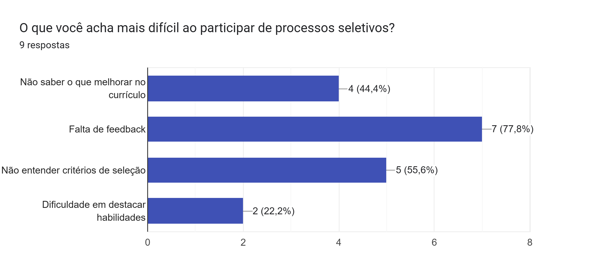
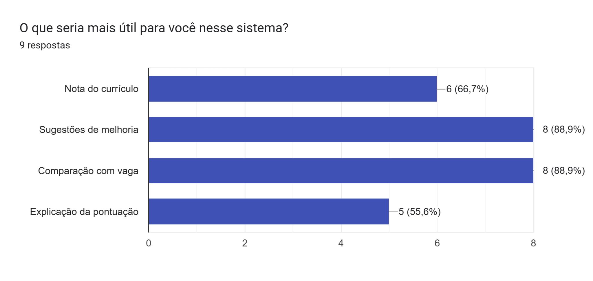
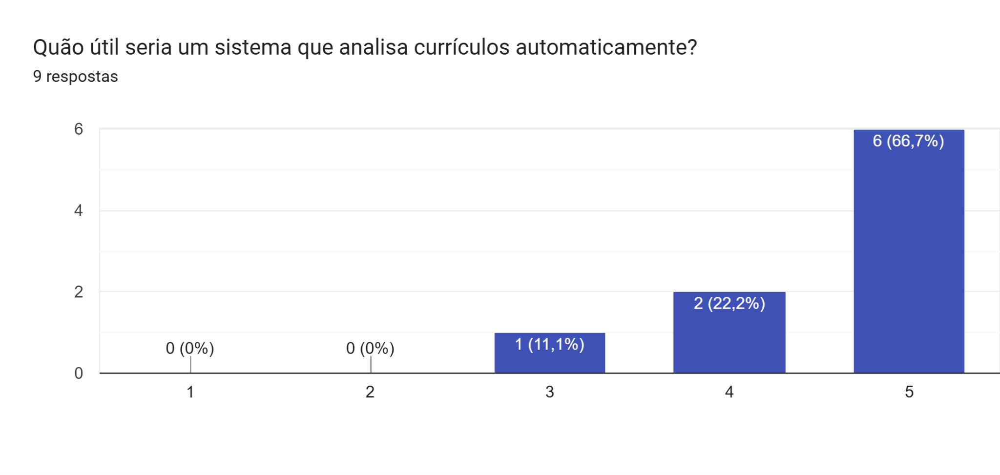

**Interpretação dos dados:**
Os resultados indicam que existe uma dificuldade significativa na compreensão dos critérios de seleção. O processo atual apresenta baixa transparência, indicando uma forte demanda por automação e padronização, mostrando que tanto candidatos quanto recrutadores se beneficiariam de uma solução integrada.

### 1.3. ANÁLISE DE SOLUÇÕES EXISTENTES (BENCHMARK)
Para validar a viabilidade e necessidade de desenvolvimento de um sistema de análise de currículos, foram analisadas as principais alternativas tecnológicas disponíveis no mercado:

#### 1. LinkedIn
- **Link:** https://www.linkedin.com
- **Público-alvo:** Profissionais e recrutadores
- **Principais funcionalidades:** Criação de perfil profissional, publicação de vagas, candidatura simplificada, busca de candidatos.
- **Pontos fortes:** Grande base de usuários, facilidade de uso, integração entre candidatos e empresas.
- **Limitações:** Não realiza análise detalhada de currículos, não fornece pontuação ou ranking automático, falta de transparência nos critérios de seleção.
  
  **Figura 1** - Perfil do LinkedIn
  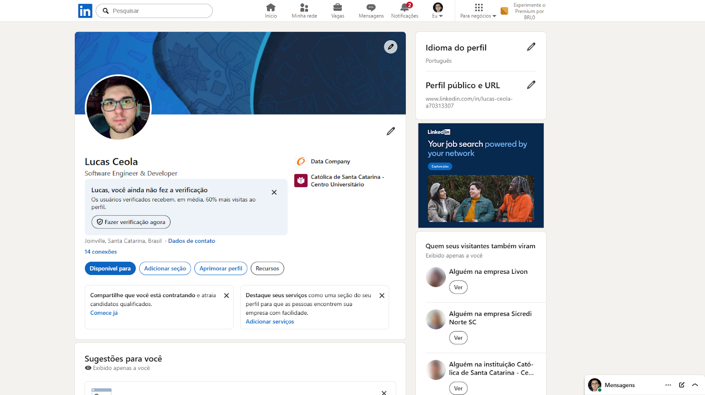
  *Fonte: Print retirada do LinkedIn do próprio autor.*

#### 2. Jobscan
- **Link:** https://jobscan.co
- **Público-alvo:** Candidatos
- **Principais funcionalidades:** Comparação de currículo com vaga, identificação de palavras-chave, sugestões de melhoria.
- **Pontos fortes:** Foco na melhoria do currículo, interface simples, feedback direto ao usuário.
- **Limitações:** Não atende recrutadores, baseado fortemente em palavras-chave, não realiza ranking entre candidatos.

  **Figura 2** - Relatório de exemplo (Jobscan)
  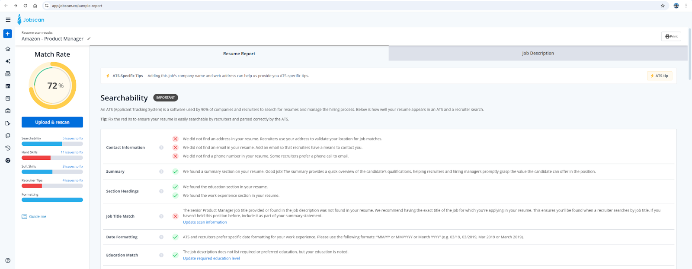
  *Fonte: Print retirada do website Jobscan, mostrando a interface de relatório e a pontuação obtida pela qualidade do currículo analisado.*
  

#### 3. Workable
- **Link:** https://www.workable.com
- **Público-alvo:** Empresas e recrutadores
- **Principais funcionalidades:** Gestão de vagas, triagem de candidatos, pipeline de contratação.
- **Pontos fortes:** Sistema completo de recrutamento, organização do processo seletivo, integração com outras ferramentas.
- **Limitações:** Alto custo, triagem pouco transparente, dependência de filtros simples.

  **Figura 3** - Dashboard do serviço Workable
  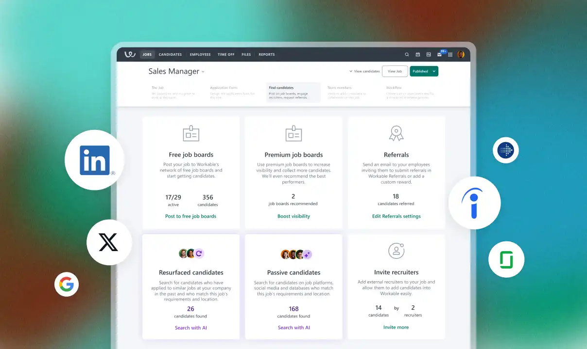
  *Fonte: Imagem retirada do website Workable, mostrando a interface do serviço.*  

#### 4. HireVue
- **Link:** https://www.hirevue.com
- **Público-alvo:** Grandes empresas
- **Principais funcionalidades:** Entrevistas em vídeo, avaliação automatizada, análise comportamental.
- **Pontos fortes:** Avaliação mais aprofundada, escalável.
- **Limitações:** Processo complexo, foco fora da análise de currículo, alta barreira de uso.

  **Figura 4** - Ranqueamento de candidatos (HireVue)
  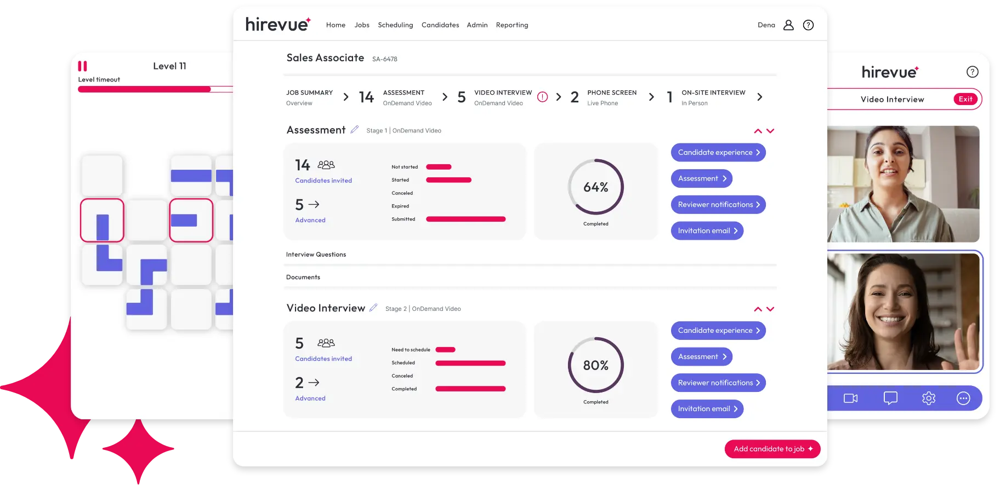
  *Fonte: Imagem retirada do website HireVue, apresentando o nível de qualificação de dois ou mais candidatos a uma vaga de emprego.*

#### Resumo Analítico

| Solução | Pontos Fortes | Limitações |
| :--- | :--- | :--- |
| **LinkedIn** | Ampla base de usuários e alto alcance, com integração entre candidatos e recrutadores. | Ausência de análise estruturada de currículos e falta de critérios explícitos de avaliação. |
| **Jobscan** | Feedback imediato, comparações diretas com a descrição de vaga. | Não considera contexto, ausência de comparação entre múltiplos candidatos. |
| **Workable** | Organização do pipeline de candidatos, suporte a múltiplas vagas. | Alto custo de implementação, pouca explicabilidade na pontuação. |
| **HireVue** | Escalabilidade em processos seletivos, análise comportamental adicional. | Barreira de entrada para pequenas empresas, foco fora da análise inicial de currículos. |

#### 1.3.1. DIFERENCIAL DO PROJETO
Diante da análise realizada, observa-se que as soluções existentes atendem apenas parcialmente às necessidades do processo de seleção, apresentando limitações relevantes tanto para candidatos quanto para recrutadores. Nesse contexto, identifica-se a ausência de uma solução que integre de forma equilibrada as necessidades de ambos os públicos, oferecendo uma análise estruturada, transparente e acessível de currículos.

Diferentemente das ferramentas analisadas, o sistema proposto neste trabalho apresenta os seguintes diferenciais:
- Análise baseada em algoritmo próprio, sem dependência exclusiva de palavras-chave;
- Transparência na avaliação, permitindo visualizar como a pontuação foi calculada;
- Ranqueamento automático de candidatos, com base em critérios definidos;
- Acessibilidade, visando utilização por pequenas e médias empresas.

Assim, o projeto busca preencher a lacuna existente entre ferramentas voltadas exclusivamente para candidatos e sistemas focados apenas em recrutadores, propondo uma solução integrada e explicável para o processo de análise de currículos.

### 1.4. PÚBLICO-ALVO
O sistema proposto é **direcionado** a dois públicos principais: candidatos a vagas de emprego e recrutadores ou profissionais responsáveis por processos seletivos, caracterizando uma abordagem híbrida.

#### Candidatos:
- **Perfil do usuário:** Estudantes ou profissionais em busca de oportunidades no mercado de trabalho; Pessoas que desejam melhorar seus currículos; Usuários com diferentes níveis de experiência profissional.
- **Contexto de uso:** Enviar seus currículos; Obter uma avaliação automatizada; Identificar pontos fortes e pontos de melhoria; Comparar seu perfil com requisitos de vagas. O uso ocorre, principalmente, durante a preparação para processos seletivos ou após receberem retorno negativo em candidaturas.
- **Nível de conhecimento técnico:** Básico a intermediário. Familiaridade com navegação web. Não é necessário conhecimento técnico avançado.

#### Recrutadores / Empresas:
- **Perfil de usuário:** Profissionais de Recursos Humanos; Gestores responsáveis por contratação; Pequenas e médias empresas com necessidade de triagem de currículos.
- **Contexto de uso:** Criar vagas com critérios específicos; Receber currículos de candidatos; Obter um ranking automático de candidatos; Analisar justificativas das pontuações atribuídas. O uso ocorre durante o processo de triagem inicial, com o objetivo de reduzir o tempo gasto na análise manual.
- **Nível de conhecimento técnico:** Básico a intermediário. Experiência com ferramentas digitais corporativas. Não é necessário conhecimento técnico especializado.

#### 1.4.1. DIFERENCIAL DO PÚBLICO-ALVO
Diferentemente de soluções tradicionais, que atendem exclusivamente candidatos ou recrutadores, o sistema proposto busca integrar ambos os perfis em uma única plataforma, promovendo maior alinhamento entre as expectativas do mercado e as qualificações dos profissionais.

### 1.5. OBJETIVOS DO PROJETO

#### 1.5.1. OBJETIVO GERAL
Desenvolver uma plataforma web para análise e ranqueamento de currículos, baseada em um algoritmo próprio, capaz de avaliar candidatos de forma automatizada, transparente e acessível, atendendo tanto às necessidades de recrutadores quanto de candidatos.

#### 1.5.2. OBJETIVOS ESPECÍFICOS
- Desenvolver um sistema capaz de realizar a análise automatizada de currículos, reduzindo a necessidade de triagem manual.
- Implementar um algoritmo de pontuação baseado em critérios explícitos, com habilidades, experiência e formação.
- Permitir a criação de vagas com definição de requisitos e pesos, possibilitando avaliações personalizadas.
- Gerar um ranking de candidatos com base na compatibilidade com a vaga, **facilitando a tomada de decisão, a qual caberá integralmente ao recrutador humano.**
- Disponibilizar ao usuário uma visualização detalhada da pontuação, promovendo transparência no processo de avaliação.

### 1.6. MÉTRICAS DE SUCESSO (KPIs)
A avaliação do sucesso do projeto será realizada com base em métricas relacionadas ao desempenho do sistema, eficiência do processo de análise e qualidade dos resultados apresentados aos usuários:
- O sistema deve realizar a análise de um currículo em até 2 segundos;
- Redução de pelo menos 50% no tempo de triagem inicial em relação à análise manual;
- O algoritmo deve gerar resultados determinísticos e consistentes para os mesmos dados de entrada;
- Suporte a pelo menos 20 usuários simultâneos sem degradação significativa de desempenho;
- Pelo menos 80% dos usuários devem ser capazes de compreender a pontuação gerada pelo sistema (com base em questionário);
- Pelo menos 75% dos usuários devem avaliar o sistema como útil ou muito útil.

---

## 2. ENGENHARIA DE REQUISITOS

### 2.1. PERSONAS

#### 2.1.1. PERSONA 1
- **Candidato:** João Silva
- **Idade:** 23 anos
- **Cargo/Ocupação:** Estudante de Engenharia de Software e Desenvolvedor Júnior
- **Objetivos:** Conseguir sua primeira oportunidade na área de tecnologia; Melhorar a qualidade do currículo; Entender quais competências são mais valorizadas pelas empresas; Aumentar suas chances de aprovação em processos seletivos.
- **Dores:** Raramente recebe feedback após participar de processos seletivos; Não sabe quais informações do currículo precisam ser melhoradas; Tem dificuldade em identificar se seu perfil é compatível com uma vaga; Não compreende os critérios utilizados pelos recrutadores na triagem inicial.
- **Contexto de uso:** João utiliza a plataforma para enviar seu currículo e receber uma análise detalhada sobre seu perfil profissional. Ele busca identificar pontos fortes, oportunidades de melhoria e verificar sua compatibilidade com vagas de interesse antes de realizar candidaturas.

#### 2.1.2. PERSONA 2
- **Recrutadora:** Mariana Souza
- **Idade:** 34
- **Cargo/Ocupação:** Analista de Recursos Humanos
- **Objetivos:** Reduzir o tempo gasto na análise manual de currículos; Encontrar candidatos compatíveis com as vagas da empresa; Padronizar os critérios de avaliação utilizados nos processos seletivos; Tornar a triagem inicial mais rápida e eficiente.
- **Dores:** Recebe um grande volume de currículos para cada vaga publicada; O processo de triagem inicial é repetitivo e demorado; Dificuldade em comparar candidatos utilizando critérios consistentes; Nem sempre consegue justificar de forma clara a escolha de determinados candidatos.
- **Contexto de uso:** Mariana utiliza a plataforma para criar vagas, definir requisitos e receber automaticamente um ranking dos candidatos mais compatíveis. O sistema auxilia na tomada de decisão, fornecendo pontuação e justificativas que tornam o processo seletivo mais transparente e organizado.

### 2.2. CASOS DE USO PRINCIPAIS
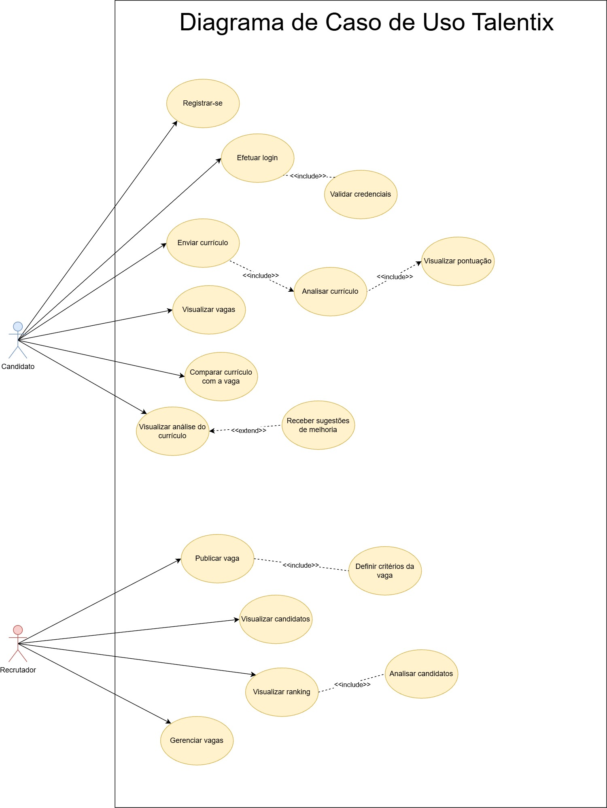

### 2.3. REQUISITOS FUNCIONAIS (RF)

**Candidatos:**
- **RF01:** O sistema deve permitir o cadastro de candidatos.
- **RF02:** O sistema deve permitir autenticação (login/logout) de usuários.
- **RF03:** O sistema deve permitir que o candidato envie seu currículo em formato digital (PDF ou texto).
- **RF04:** O sistema deve analisar automaticamente o currículo enviado.
- **RF05:** O sistema deve gerar uma pontuação baseada em critérios definidos (habilidades, experiência, formação).
- **RF06:** O sistema deve apresentar ao candidato um relatório com: Pontuação geral, Critérios avaliados, Sugestões de melhoria.
- **RF07:** O sistema deve permitir que o candidato visualize vagas disponíveis.
- **RF08:** O sistema deve permitir comparar o currículo do candidato com os requisitos de uma vaga.

**Recrutadores / Empresas:**
- **RF09:** O sistema deve permitir o cadastro de recrutadores.
- **RF10:** O sistema deve permitir que recrutadores criem vagas com requisitos definidos.
- **RF11:** O sistema deve permitir definir critérios e pesos para avaliação de candidatos.
- **RF12:** O sistema deve receber currículos vinculados às vagas criadas.
- **RF13:** O sistema deve gerar automaticamente um ranking de candidatos para cada vaga, **servindo como ferramenta de apoio à triagem inicial sem autonomia de desclassificação definitiva.**
- **RF14:** O sistema deve permitir visualizar os detalhes da pontuação de cada candidato.

**Sistema:**
- **RF15:** O sistema deve utilizar um algoritmo próprio para análise de currículos.
- **RF16:** O sistema deve garantir que a avaliação seja baseada em critérios explícitos e configuráveis.
- **RF17:** O sistema deve armazenar os dados dos usuários, currículos e vagas.

### 2.4. REQUISITOS NÃO FUNCIONAIS (RNF)
- **Desempenho (RNF01, RNF02):** Processar análise em até 2 segundos e suportar no mínimo 20 usuários simultâneos.
- **Segurança (RNF03, RNF04):** Garantir autenticação segura e proteger dados conforme boas práticas.
- **Usabilidade (RNF05, RNF06):** Interface intuitiva e pontuação facilmente compreensível.
- **Confiabilidade (RNF07):** Resultados consistentes para os mesmos dados de entrada.
- **Compatibilidade (RNF08):** Acessível via navegadores modernos (Chrome, Edge, Firefox).
- **Escalabilidade (RNF09):** Permitir expansão futura.

### 2.5. REGRAS DE NEGÓCIO
- **RN01:** Apenas usuários autenticados podem acessar funcionalidades internas.
- **RN02:** Currículos enviados devem estar em formato **PDF ou texto**.
- **RN03:** Cada vaga deve possuir ao menos um critério de avaliação definido.
- **RN04:** O ranking de candidatos deve ser gerado automaticamente após a análise dos currículos.
- **RN05:** A pontuação dos candidatos deve ser baseada em critérios explícitos.
- **RN06:** O sistema não deve permitir duplicidade de cadastro utilizando o mesmo e-mail.
- **RN07:** Sugestões de melhoria devem ser exibidas apenas após conclusão da análise.
- **RN08:** **O sistema funcionará estritamente como apoio à decisão; nenhuma contratação ou eliminação final será executada de forma autônoma pelo algoritmo.**

### 2.6. FORA DO ESCOPO
- Realização de entrevistas online.
- Comunicação direta entre candidatos e recrutadores.
- Integração com plataformas externas de recrutamento.
- Sistema completo de folha de pagamento ou RH.
- Análise comportamental avançada baseada em vídeo.
- Aplicativo mobile nativo.
- Utilização de inteligência artificial generativa.
- Suporte multilíngue.

---

## 3. FLUXO E COMPORTAMENTO DO SISTEMA

### 3.1. FLUXO PRINCIPAL DO USUÁRIO
O fluxo principal do usuário representa o caminho esperado durante a utilização do sistema Talentix, considerando o cenário mais comum de interação de um candidato com a plataforma.

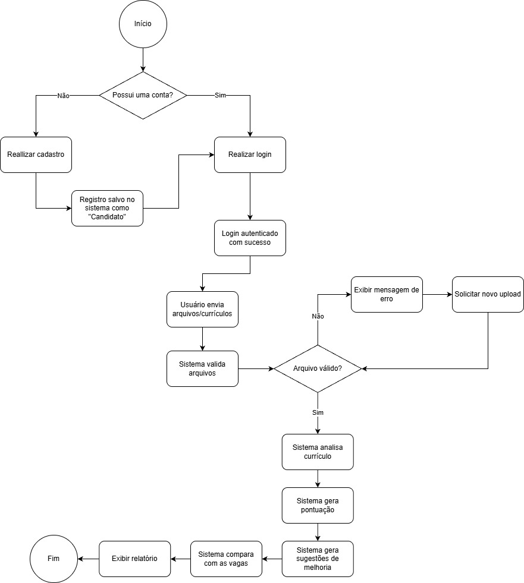

*Fonte: Elaborado pelo autor com o auxílio da ferramenta Draw.io (2026)*

### 3.2. FLUXOS ALTERNATIVOS
Já o fluxo alternativo é responsável por apresentar o caminho esperado durante a utilização do sistema Talentix, considerando  um cenário de interação entre o recrutador com a plataforma.

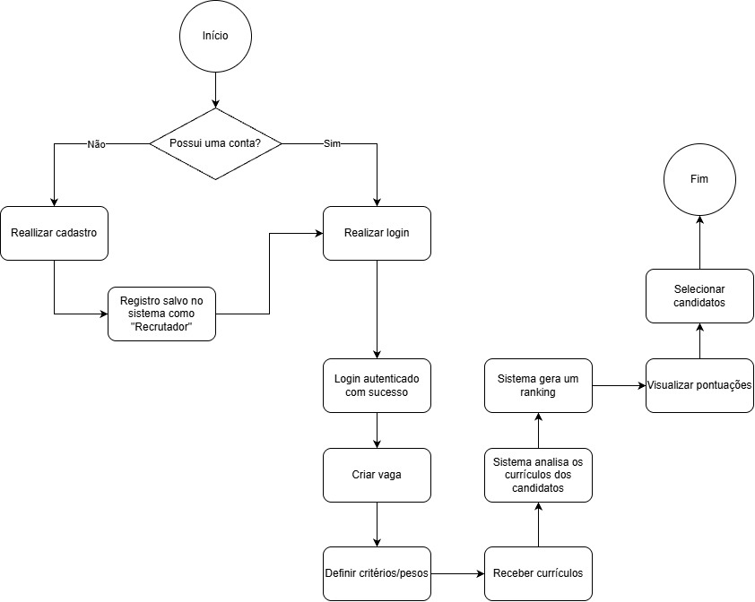

*Fonte: Elaborado pelo autor com o auxílio da ferramenta Draw.io (2026)*

---

## 4. MOCKUPS E EXPERIÊNCIA DO USUÁRIO (UX)

### 4.1. FLUXO DE NAVEGAÇÃO
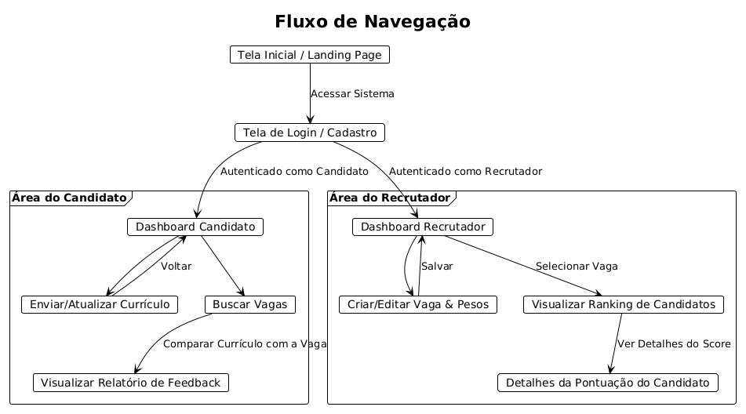

*Fonte: Elaborado pelo autor com o auxílio da ferramenta PlantUML (2026)*

### 4.2. WIREFRAME DAS TELAS

- Tela de Login e Cadastro.

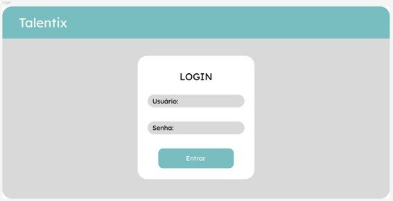

- Dashboard - Candidatos (Visão geral de pontuações e compatibilidade com vagas).

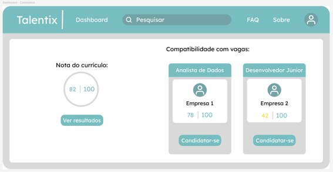

- Resultado da Análise Candidatos (Habilidades detectadas e melhorias).

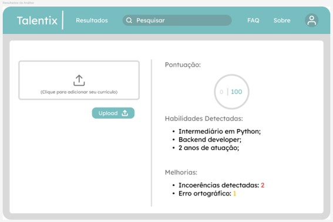

- Dashboard - Recrutadores (Vagas ativas e média de pontuações).

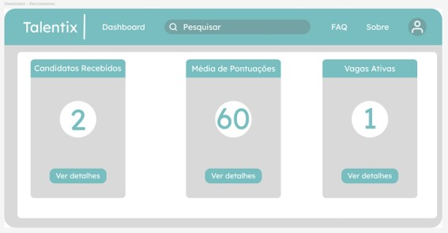

- Criar Vaga - Recrutadores (Formulário de Título, Descrição, Requisitos e Pesos).

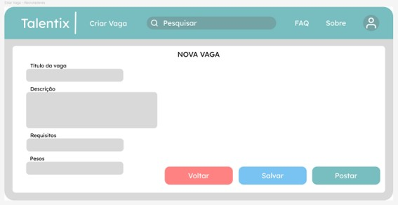

### 4.3. FLUXO DE INTERAÇÃO DO USUÁRIO
**Candidato:**

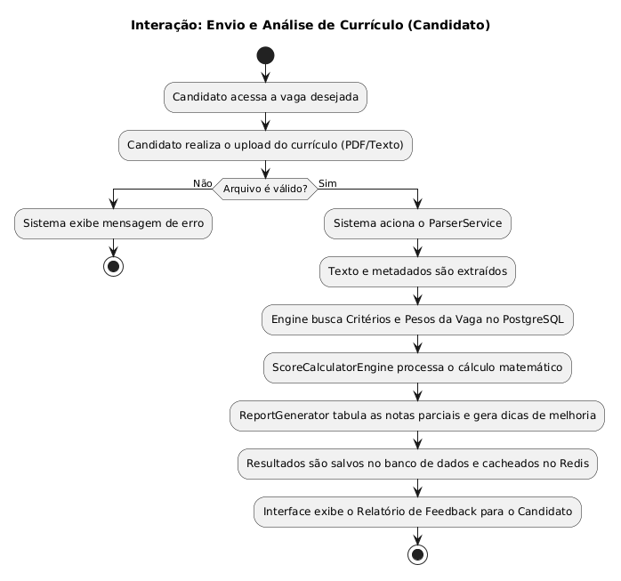

*Fonte: Elaborado pelo autor com o auxílio da ferramenta PlantUML (2026)*

**Recrutador:**

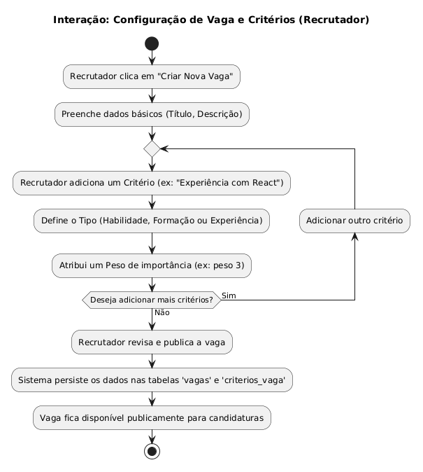

*Fonte: Elaborado pelo autor com o auxílio da ferramenta PlantUML (2026)*

---

## 5. ARQUITETURA DO SISTEMA

### 5.1. DIAGRAMA C4

**1. NÍVEL 1: DIAGRAMA DE CONTEXTO**

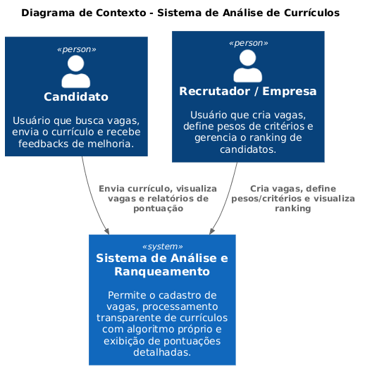

*Fonte: Elaborado pelo autor com o auxílio da ferramenta PlantUML (2026)*

**2. NÍVEL 2: DIAGRAMA DE CONTAINERS**

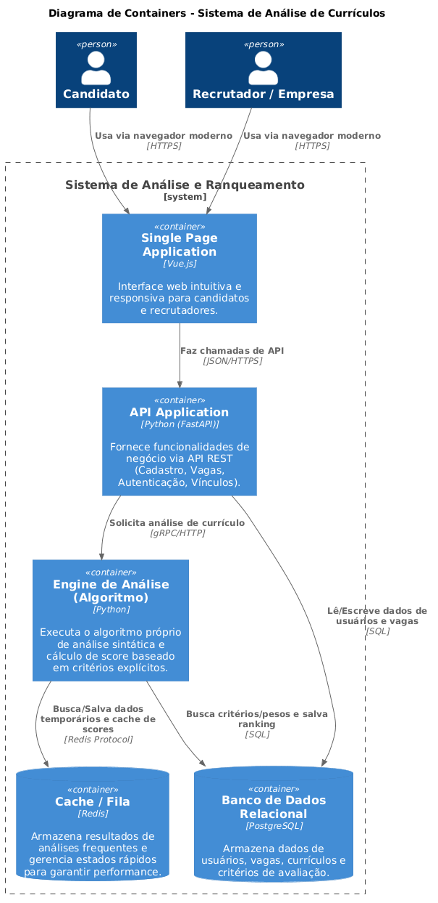

*Fonte: Elaborado pelo autor com o auxílio da ferramenta PlantUML (2026)*

**3. NÍVEL 3: DIAGRAMA DE COMPONENTES**

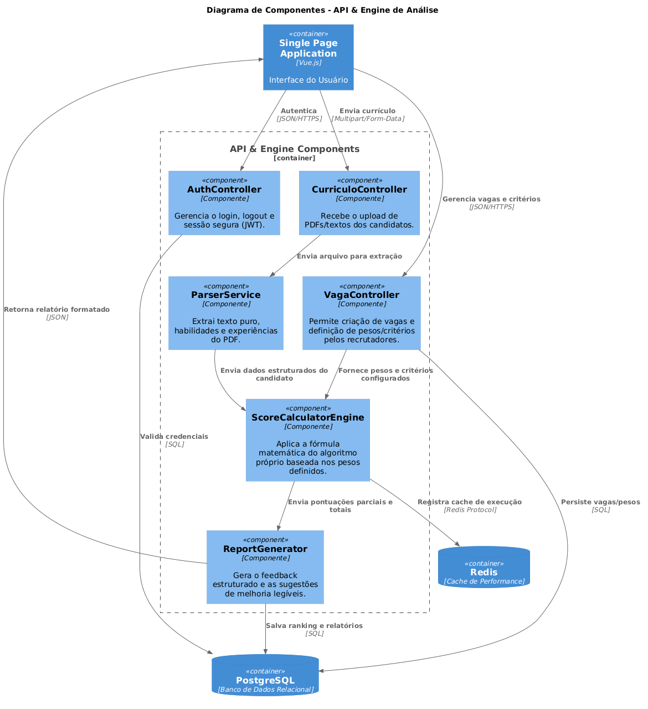

*Fonte: Elaborado pelo autor com o auxílio da ferramenta PlantUML (2026)*

### 5.2. MODELO DE DADOS
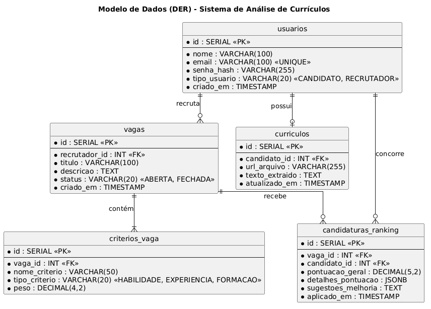

*Fonte: Elaborado pelo autor com o auxílio da ferramenta PlantUML (2026)*

### 5.3. PRINCIPAIS COMPONENTES
1. **AuthController:** Responsável por garantir acessos seguros via tokens, como o JWT, protegendo as rotas de candidatos e recrutadores conforme as boas práticas (RNF03 e RNF04).
2. **Parser de Documentos (Ingestion Engine):** Componente isolado encarregado de receber o upload de arquivos primordialmente em formato **PDF ou texto**, para extrair os metadados brutos e normalizar a informação para leitura do algoritmo.
3. **Core Engine (Algoritmo Proprietário):** O coração do sistema. Ele cruza os dados extraídos do currículo com as regras contidas na tabela "criterios_vaga". Por trabalhar de forma estritamente matemática e condicional (sem caixas-pretas), cumpre o requisito de transparência absoluta.
4. **Gerador de Feedbacks (Explainer Component):** Componente que traduz a pontuação final gerada pela Engine em uma interface amigável para o usuário, mapeando as lacunas.

### 5.4. STACK TECNOLÓGICA
A escolha das tecnologias foca em alta performance para análise síncrona e assíncrona, e facilita a manipulação de strings para o algoritmo:
- **Frontend:** Vue.js (Garante uma SPA fluida, atendendo à usabilidade intuitiva do RNF05 e RNF06).
- **Backend / API:** Python (FastAPI).
- **Engine do Algoritmo:** Python.
  - *Justificativa:* Bibliotecas nativas e maduras de processamento de texto e extração de PDF (PyPDF, pdfplumber ou ferramentas de Expressões Regulares) permitem construir um algoritmo determinístico rápido, explícito e altamente auditável, unificando a API e a Engine num ecossistema performático de alto nível.
- **Banco de Dados Principal:** PostgreSQL.
  - *Justificativa:* Banco relacional robusto, ideal para consistência de dados (RNF07), além de possuir excelente suporte nativo ao tipo de dado JSONB para salvar detalhes das pontuações mutáveis de forma performática.
- **Mecanismo de Cache:** Redis.
  - *Justificativa:* Essencial para guardar em memória temporária as sessões de usuários simultâneos (RNF02) e os resultados de relatórios de vagas já calculados, aliviando o banco de dados principal.

---

## 6. SEGURANÇA E PRIVACIDADE
O sistema Talentix será responsável pelo armazenamento e gerenciamento de informações pessoais e dados sensíveis de candidatos e recrutadores, incluindo dados profissionais, currículos e informações relacionadas a processos seletivos. Dessa forma, aspectos relacionados à segurança da informação, bem como a privacidade dos usuários, devem ser rigorosamente considerados durante o desenvolvimento da plataforma.

Nesse contexto, a segurança do sistema tem como objetivo garantir a confidencialidade, integridade, disponibilidade e a confiabilidade dos dados armazenados, de modo a evitar acessos não autorizados, alterações indevidas ou vazamentos de dados sensíveis. Para isso, o sistema implementará mecanismos de autenticação e autorização baseados no perfil de usuário. Candidatos poderão acessar apenas seus próprios currículos e análises, enquanto recrutadores receberão acesso restrito apenas às vagas e candidatos de seus respectivos processos seletivos.

Além disso, serão adotadas práticas de segurança recomendadas pela OWASP (Open Web Application Security Project). Dentre as medidas previstas estão a validação e sanitização de dados inseridos pelo usuário, proteção contra ataques de injeção de código, controle adequado de permissões e prevenção contra acessos indevidos.

Por conseguinte, devido à necessidade de envio de currículos, o sistema também apresentará mecanismos de proteção para upload de arquivos, permitindo apenas formatos previamente definidos, como **PDF ou texto**, limitando o tamanho de documentos e realizando validações para evitar o armazenamento de arquivos maliciosos. As informações sensíveis serão protegidas por criptografia (HTTPS/TLS) durante a comunicação, e as senhas armazenadas com técnicas robustas de hash.

### 6.1. PRIVACIDADE E LGPD
A aplicação deverá seguir os princípios estabelecidos pela Lei Geral de Proteção de Dados (LGPD). Os dados coletados pelo sistema serão utilizados exclusivamente para as funcionalidades relacionadas à análise de currículos e gerenciamento de processos seletivos (como nome, e-mail e dados profissionais inseridos no currículo).

Os dados serão armazenados em ambiente seguro e não serão disponibilizados publicamente, sendo compartilhados apenas quando o candidato autorizar a candidatura a uma vaga específica. O usuário terá controle total sobre seus dados, possibilitando a visualização, atualização ou exclusão definitiva (direito ao esquecimento) de seu cadastro, currículo e histórico de análises.

Importante ressaltar que, como o sistema atua em processos seletivos, o algoritmo zelará pela transparência dos critérios utilizados para a geração das pontuações, evitando decisões completamente automatizadas sem explicação (caixa-preta). O algoritmo servirá unicamente como uma ferramenta de apoio à triagem inicial, garantindo que o poder de decisão e contratação permaneça 100% sob responsabilidade do recrutador humano.

---

## 7. PLANEJAMENTO DO PROJETO

| MARCO | DESCRIÇÃO | PRAZO |
| :--- | :--- | :--- |
| **M1** | Configuração do ambiente de desenvolvimento, definição da arquitetura do sistema e criação da estrutura inicial do projeto. | Semana 1 |
| **M2** | Modelagem do banco de dados e implementação da autenticação de usuários. | Semana 2 |
| **M3** | Desenvolvimento das funcionalidades principais do candidato (cadastro, envio de currículo e visualização da análise). | Semana 4 |
| **M4** | Desenvolvimento das funcionalidades principais do recrutador (criação de vagas, definição de critérios e gerenciamento de candidatos). | Semana 6 |
| **M5** | Desenvolvimento do algoritmo de avaliação e ranqueamento de currículos baseado nos critérios definidos. | Semana 8 |
| **M6** | Integração do algoritmo de análise entre o frontend e o backend, ajustes de interface e UX. | Semana 10 |
| **M7** | Realização de testes, correções de erros e validação com usuários. | Semana 12 |
| **M8** | Documentação final e preparação da apresentação do projeto. | Semana 14 |

*(As seções de detalhamento das Fases de Desenvolvimento 1, 2 e 3 foram omitidas do resumo da tabela, mas constam integralmente no plano do projeto para condução das etapas ao longo das 14 semanas).*

---

## 8. REFERÊNCIAS
- **LINKEDIN.** Linkedin, 2003. Disponível em: https://www.linkedin.com/. Acesso em: 09 abr. 2026.
- **JOBSCAN.** Jobscan, 2013. Disponível em: https://www.jobscan.co/. Acesso em: 09 abr. 2026.
- **WORKABLE.** Workable, 2012. Disponível em: https://www.workable.com/. Acesso em: 10 abr. 2026.
- **HIREVUE.** HireVue, 2004. Disponível em: https://www.hirevue.com/. Acesso em: 11 abr. 2026.

---

## 9. APÊNDICES

### 9.1 ENTREVISTA COM USUÁRIO
- **Entrevistado:**
Sandro Marcio Ceola
- **Cargo:**
Analista de RH
- **Experiência:**
23 anos

**Pergunta 1**: Como ocorre atualmente o processo de definição dos requisitos de uma vaga?

*Resposta:* 
Primeiramente, o profissional de RH e o gestor da área definem os requisitos básicos para a vaga, como escolaridade, tempo de experiência, conhecimentos técnicos e competências comportamentais. Também podem ser adicionados requisitos desejáveis, como conhecimento em idiomas, experiência com softwares específicos ou outras características relevantes.

*Análise:*
Foi identificado que o processo seletivo depende de uma definição clara dos critérios da vaga. Dessa forma, o Talentix poderá utilizar esses critérios como base para realizar comparações entre candidatos e oportunidades.
   
**Pergunta 2**: Como os currículos são organizados e analisados atualmente?

*Resposta:* 
A empresa utiliza a plataforma Gupy, que funciona como uma biblioteca de currículos, armazenando e apresentando candidatos conforme palavras-chave pesquisadas. Após essa filtragem inicial, um recrutador realiza a análise dos currículos pela plataforma.

*Análise:*
Observa-se que soluções atuais utilizam mecanismos baseados principalmente em palavras-chave para realizar uma primeira seleção. Essa abordagem tende a reduzir o tempo de busca, porém apresenta limitações relacionadas à compreensão do contexto do currículo, ou seja, reforçando a proposta do Talentix de utilizar critérios mais amplos para análise.
   
**Pergunta 3**: Além do currículo, quais outros fatores são considerados na seleção de um candidato?

*Resposta:* 
Também é realizado um bate-papo para verificar se os valores do candidato estão alinhados com os valores da empresa. Após isso, os candidatos pré-selecionados podem realizar testes ou entrevistas.

*Análise:*
A entrevista demonstra que o currículo é apenas uma etapa inicial do processo seletivo, sendo necessário considerar fatores comportamentais e culturais.
   
**Pergunta 4**: Quais melhorias poderiam ser aplicadas no processo atual?

*Resposta:* 
Acredito que deveria existir uma sistemática mais elaborada com formulário de cadastro de currículo.

*Análise:*
A resposta indica uma oportunidade de melhoria relacionada à padronização das informações profissionais dos candidatos.

---

## 10. PARECER DO COMITÊ DE AVALIAÇÃO

 

**Avaliador 1:** ____________________________________________________

- **Status:** 
  - [ ] Aprovado
  - [ ] Ajustar
- **Observações:** 

   

**Avaliador 2:** ____________________________________________________

- **Status:** 
  - [ ] Aprovado
  - [ ] Ajustar
- **Observações:** 

   
